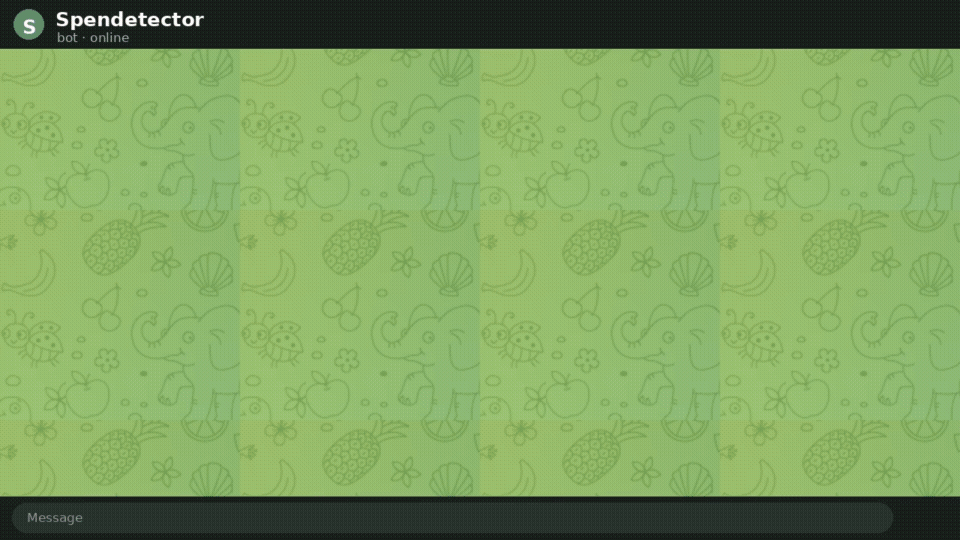

# Spendetector

> Snap a receipt, see what your bank can't: your real, itemized spending, in Notion.



Photograph a receipt in Telegram. The cloud (Modal + GPT-4o vision) reads every line item and writes it to a Notion database that draws your spending charts, including the one no bank can show: each item's price over time. The bot replies with one useful insight and a tap-through Notion link.

Plan and decisions: [`.vault/plans/2026-06-04-spendetector-plan.md`](.vault/plans/2026-06-04-spendetector-plan.md). QA checklist: [`docs/qa-checklist.yaml`](docs/qa-checklist.yaml).

## The loop

```
Telegram photo -> Modal webhook (ACK fast, spawn worker) -> GPT-4o vision (strict JSON)
  -> Notion (Receipts + Items DBs) -> Notion dashboard charts -> bot replies + tap-through link
```

## Setup

### 1. Credentials (one-time, the two things only you can provision)

1. **Telegram bot** (BotFather): create a fresh dedicated bot, copy the token.
2. **Notion integration**: at notion.so/my-integrations create an internal integration named "Spendetector", copy its token, then open your personal Spendetector page and share it with that integration.

Copy `.env.example` to `.env` and fill in the values. Nothing is hardcoded; every id/secret is an env var.

### 2. Notion databases + charts

`python -m spendetector.setup_notion` creates the Receipts + Items databases inside the shared page and prints the two database ids (paste them into `.env`). The dashboard charts are created via the Notion MCP `create-view` and configured (value-axis aggregation) via `python scripts/configure_charts.py`, which uses the public `PATCH /v1/views/{id}` API. Fully automated, no manual chart-building.

### 3. Deploy to Modal

```bash
modal profile activate mengzxapp
modal secret create spendetector-secrets   # from your .env values
modal deploy spendetector/app.py
# register the webhook (the deploy prints the URL):
curl "https://api.telegram.org/bot$TELEGRAM_BOT_TOKEN/setWebhook" \
  -d "url=<modal-url>" -d "secret_token=$TELEGRAM_WEBHOOK_SECRET"
```

## Test

```bash
pip install -e ".[dev]"
python -m pytest -q          # unit tests (no credentials needed)
ruff check spendetector
```

The integration and live end-to-end checks (real bot, real receipt, real Notion) are the gate that actually matters; see `docs/qa-checklist.yaml` (sections C, I).

## Privacy

Card digits are never extracted or stored. We never sell data. The OpenAI project runs with data retention and training opt-out. One-tap export/delete is on the roadmap.
